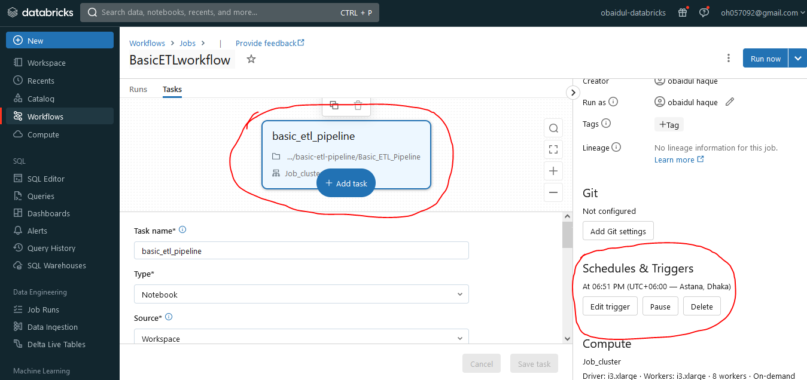

# Basic ETL Pipeline
https://docs.databricks.com/en/getting-started/etl-quick-start.html


## Step 1: Create a cluster
To do exploratory data analysis and data engineering, create a cluster to provide the compute resources needed to execute commands.

    1.1 Click compute icon Compute in the sidebar.

    1.2 On the Compute page, click Create Cluster. This opens the New Cluster page.

    1.3 Specify a unique name for the cluster, leave the remaining values in their default state, and click Create Cluster.

## Step 2: Create a Databricks notebook 
To get started writing and executing interactive code on Databricks, create a notebook.

    2.1 Click New Icon New in the sidebar, then click Notebook.

    2.2 On the Create Notebook page:

    2.3 Specify a unique name for your notebook.

    2.4 Make sure the default language is set to Python or Scala.

    2.5 Select the cluster you created in step 1 from the Cluster dropdown.

    2.6 Click Create.

  A notebook opens with an empty cell at the top.

## Step 3: Configure Auto Loader to ingest data to Delta Lake
Databricks recommends using Auto Loader for incremental data ingestion. Auto Loader automatically detects and processes new files as they arrive in cloud object storage.

Databricks recommends storing data with Delta Lake. Delta Lake is an open source storage layer that provides ACID transactions and enables the data lakehouse. Delta Lake is the default format for tables created in Databricks.

To configure Auto Loader to ingest data to a Delta Lake table, copy and paste the following code into the empty cell in your notebook:
```
# Import functions
from pyspark.sql.functions import col, current_timestamp

# Define variables used in code below
file_path = "/databricks-datasets/structured-streaming/events"
username = spark.sql("SELECT regexp_replace(current_user(), '[^a-zA-Z0-9]', '_')").first()[0]
table_name = f"{username}_etl_quickstart"
checkpoint_path = f"/tmp/{username}/_checkpoint/etl_quickstart"

# Clear out data from previous demo execution
spark.sql(f"DROP TABLE IF EXISTS {table_name}")
dbutils.fs.rm(checkpoint_path, True)

# Configure Auto Loader to ingest JSON data to a Delta table
(spark.readStream
  .format("cloudFiles")
  .option("cloudFiles.format", "json")
  .option("cloudFiles.schemaLocation", checkpoint_path)
  .load(file_path)
  .select("*", col("_metadata.file_path").alias("source_file"), current_timestamp().alias("processing_time"))
  .writeStream
  .option("checkpointLocation", checkpoint_path)
  .trigger(availableNow=True)
  .toTable(table_name))
```

## Step 4: Process and interact with data

Notebooks execute logic cell-by-cell. To execute the logic in your cell:

  4.1 To run the cell you completed in the previous step, select the cell and press SHIFT+ENTER.

  4.2 To query the table you’ve just created, copy and paste the following code into an empty cell, then press SHIFT+ENTER to run the cell.
  ```
    df = spark.read.table(table_name)

  ```

  4.3 To preview the data in your DataFrame, copy and paste the following code into an empty cell, then press SHIFT+ENTER to run the cell.
  ```
  display(df)

  ```
## Step 5: Schedule a job
You can run Databricks notebooks as production scripts by adding them as a task in a Databricks job. In this step, you will create a new job that you can trigger manually.

To schedule your notebook as a task:

  5.1 Click Schedule on the right side of the header bar.

  5.2 Enter a unique name for the Job name.

  5.3 Click Manual.

  5.4 In the Cluster drop-down, select the cluster you created in step 1.

  5.5 Click Create.

  5.6 In the window that appears, click Run now.

  5.7 To see the job run results, click the External Link icon next to the Last run timestamp.



